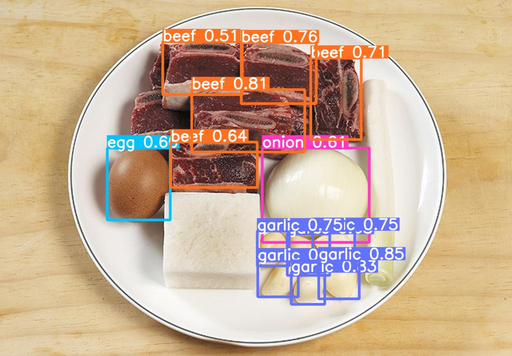

# Object Detection Service

This is a repository for the Object Detection Service using Python, YoloV5, and FastAPI. This service allows user to scan ingredients using object detection and receive the ingredients list from their photo.

## Feature

-
-

## Directory Structure

```bash
- model             # model used by the application
- yolov5            # yolov5 model library
- get_model.py      # Module to load model
- main.py           # Main module to run the FastAPI service
- Dockerfile        # Docker configuration to build the image
- requirements.txt  # List of required dependencies
```

## Installation

- Make sure you have Python 3.x installed on your local machine.
- Clone this repository to your local machine.

```bash
git clone https://github.com/Reseepe/object-detection.git
```

### Activate the virtual environment: 

```bash
python -m venv venv
```

### Install the project dependencies:

```bash
pip install -r requirements.txt
```

### Start

```bash
uvicorn main:app --port 8080
```

## API Reference

#### Get Ingredients list (json)

```
POST /object-to-json
```

| Parameter     | Type      | Description                           |
| :--------     | :---      | :==========                           |
| `file      `  | `image `  | **Required**. Ingredients Photo       |
```

Example Response

```json
{
    "result": [
        {
            "xmin": 598.3992919922,
            "ymin": 0.0,
            "xmax": 932.0836791992,
            "ymax": 436.6681518555,
            "confidence": 0.3351796567,
            "class": 103,
            "name": "Sweet Potato -Suthuni-"
        },
        {
            "xmin": 103.6419219971,
            "ymin": 0.0,
            "xmax": 444.1747131348,
            "ymax": 422.6817321777,
            "confidence": 0.3097078502,
            "class": 31,
            "name": "Chicken"
        }
    ]
}
```

#### Get Ingredients list (image)

```
POST /object-to-image
```

| Parameter     | Type      | Description                           |
| :--------     | :---      | :==========                           |
| `file      `  | `image `  | **Required**. Ingredients Photo       |

Example Response




Bangkit Team C241-PS428

Bangkit Academy 2024 batch 1
